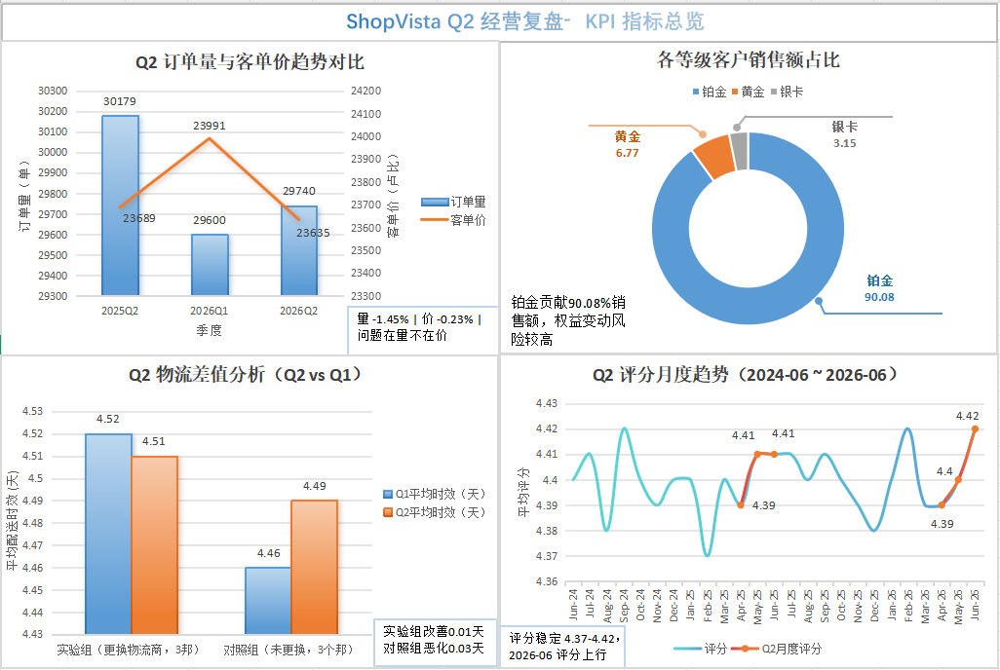

# 🛍️ 印度电商数据分析项目

## 📝项目总览
本项目为模拟电商Q2经营复盘的数据分析实战项目，基于Kaggle公开印度电商多表数据集开展完整业务分析。
使用MySQL完成从建表、脏数据清洗到复杂业务指标计算全流程，综合运用RFM客户分层、双重差分DID等分析方法，回答4个CEO真实业务决策问题。
完成交易表现、客户价值、物流履约、售后质量四大板块拆解，输出可落地业务优化建议。
产出包含SQL脚本、经营复盘文档、Excel KPI看板，全部代码与文档开源可复现。
> ⚠️ 声明：数据集为公开模拟数据集，非企业真实业务，分析结论仅用于个人学习与求职展示。

<details>
<summary>📎 简历摘要（点击展开，简历可直接复用核心指标）</summary>

> 本小节提炼项目核心量化成果
- **数据源规模**：25万条销售订单、4万名客户、2000款商品，customers/products/sales多表关联数据集
- **技术实现**：MySQL完成数据清洗；编写10+条业务SQL，使用JOIN / CTE /窗口函数 / RFM客户分层 / DID双重差分；Excel制作KPI业务看板
- **核心业务发现1**：平台新增客户由月峰值8877人下滑至24人，识别获客与会员体系风险，输出渠道排查、会员重构建议
- **核心业务发现2**：Platinum客户贡献90%销售额；RFM识别7557名高价值沉睡用户，人均消费18.6万，为用户召回提供依据
- **核心业务发现3**：双重差分DID评估物流商切换，验证未达到10%时效改善承诺，提示规避无效续约投入
- **核心业务发现4**：Q2客户评分稳定4.40分，订单波动未造成服务质量下降；交付完整复盘报告+KPI看板

</details>


> 📌 **项目状态**：数据清洗已完成 ✅ | 深度分析已完成 ✅

**项目简介**：基于 Kaggle 公开数据集，对印度电商平台的 25 万条销售记录进行多维度 SQL 分析，涵盖交易表现、客户结构、履约效率、售后质量四大方向，输出可落地的业务洞察与改善建议。

**数据库**：MySQL 8.0 | 数据库名：`indian_ecommerce_project`


## 📁 数据来源

- **数据集名称**：Indian E-Commerce Sales Analytics Dataset
- **作者**：[Jatin Khandelwal](https://www.kaggle.com/jatinkhandelwal112)
- **来源平台**：[Kaggle](https://www.kaggle.com/datasets/jatinkhandelwal112/indian-e-commerce-sales-analytics-dataset)
- **许可协议**：CC0: Public Domain（公有领域）
- **数据规模**：25 万条销售记录 | 4 万名客户 | 2,000 款产品
- **表结构**：
  - `customers`：客户主数据，记录客户个人信息、会员等级（Silver → Gold → Platinum，等级依次递增）及历史消费汇总
  - `products`：产品主数据，记录产品品类、品牌、定价及用户评分
  - `sales`：销售订单明细，记录每笔交易的订单信息、支付方式、物流状态及客户评价

📄 完整字段定义：[data_dictionary.md](data_dictionary.md)

**关键外键关系**：
- `sales.Customer_ID` → `customers.Customer_ID`
- `sales.Product_ID` → `products.Product_ID`

## 📌 模拟场景：Q2 经营分析会数据报告

### 背景设定
> 本报告为个人求职项目中的模拟分析场景，非真实商业报告。
你是一家印度电商平台 **ShopVista** 的数据分析师。该平台主营电子产品、家居、时尚、体育用品等品类，拥有约 4 万名活跃客户，年 GMV 约 80 亿卢比。

2026 年 Q2（4-6 月），业务团队推进了物流升级、会员体系改版、6 月底大促等多项动作。CEO 提出复盘需求：

> **"Q2 我们做了很多动作，但我不确定这些投入是否真的有效。你帮我在会前拉一份数据报告，回答我四个问题。"**

### CEO 的 4 个核心问题

| 板块 | CEO 问题 | 背景 |
|------|---------|------|
| **交易表现** | "Q2 业务变化主要来自哪里？是订单量变化，还是客单价在变化？" | CEO 感觉 Q2 业务没怎么涨，想定位问题来源 |
| **客户结构** | "我们花那么多钱维护 Platinum 客户，真的值得吗？" | 会员改版后内部对 Platinum 权益的成本效益有争议，CEO 需要验证该时效承诺是否达成，评估物流商的合作价值 |
| **履约效率** | "Q2 更换了 3 个邦的物流商，时效真的改善了吗？" | 新物流商承诺"整体时效提升 10%"，CEO 需要验证 ROI |
| **售后质量** | "客户满意度有没有因为订单量变化而受到影响？" | 有同事担心业务调整会影响服务质量，CEO 需要确认 |

### 分析思路

1. **核心分析**：提取 2026 年 Q2（4-6 月）数据，输出季度核心指标，直接回答 CEO 的四个问题
2. **对比基线**：使用 2024-2026 年 6 月全量历史数据作为业务基线，重点对比 2025 年 Q2 做同比分析

### 你的交付物

CEO 要求你在 Q2 经营复盘会上汇报以下内容：

1. **4 张核心数据表**（每个问题 1 张，用数据直接回答 Yes/No）
2. **4 条结论 + 4 条建议**（每个问题 1 条结论 + 1 条可执行的建议）
3. **1 张 KPI 看板总览**（让 CEO 在 30 秒内看清业务健康状况）


## 🛠️ 技术栈

| 工具 | 用途 |
|------|------|
| **MySQL 8.0** | 数据存储与 SQL 分析 |
| **Navicat** | 数据库管理与查询执行 |
| **Excel / Power BI** | 数据可视化与仪表板制作 |
| **Git & GitHub** | 版本控制与项目托管 |

## ▶️项目复现步骤
1. 下载Kaggle原始数据集，导入MySQL8.0数据库
2. 执行 `sql/01_schema.sql` 完成建表
3. 执行 `sql/02_data_cleaning.sql` 执行数据清洗
4. 执行 `sql/03_analytical_queries.sql`，运行业务分析查询，输出业务指标
5. 查询结果导出CSV，用于Excel可视化制作看板

## 🔧 数据清洗（已完成）

1. **日期字段类型转换**：将 `customers.Date_of_Birth`、`sales.Order_Date`、`sales.Delivery_Date` 从 `VARCHAR` 改为 `DATE` 类型，确保日期计算函数的正确性。
2. **零日期处理**：将原始 CSV 中的占位符 `'0000-00-00'` 统一替换为 `NULL`（表示缺失值）。
3. **严格模式兼容**：在转换过程中临时关闭 MySQL 严格模式，清洗完成后恢复（兼容 MySQL 8.0，已移除废弃参数 `NO_AUTO_CREATE_USER`）。

📄 完整清洗脚本：[sql/02_data_cleaning.sql](sql/02_data_cleaning.sql)


## 📂 项目结构

```text
indian-ecommerce-analysis/
├── README.md                    # 项目说明文档
├── data_dictionary.md           # 数据字典
├── .gitignore                   # Git 忽略文件配置
├── LICENSE                      # MIT 许可证
├── kpi_dashboard.png            # KPI看板总览截图
└── sql/
    ├── 01_schema.sql            # 建表语句
    ├── 02_data_cleaning.sql     # 数据清洗脚本
    └── 03_analytical_queries.sql # 核心分析查询  
```


<details>
<summary>🔍完整项目分析正文（点击展开查看全部分析、数据表、业务结论）</summary>
## 📈 分析成果

### 板块一：交易表现分析

> **回答 CEO 问题**："Q2 业务变化主要来自哪里？是订单量变化，还是客单价在变化？"


#### 📌 核心结论

**Q2 业务同比微降 1.68%，核心原因是订单量下降（-1.45%），客单价基本持平（-0.23%）。问题在量不在价，价格策略无需调整，重点应排查获客与用户活跃度问题。**


> 📌 **CEO 核心数据表①：季度指标对比**

| 季度 | 订单量 | 销售额 | 活跃客户数 | 客单价 |
|------|--------|--------|-----------|--------|
| 2025Q2 | 30,179 | 7.15 亿 | 21,156 | 23,689 |
| 2026Q1 | 29,600 | 7.10 亿 | 20,872 | 23,991 |
| **2026Q2** | **29,740** | **7.03 亿** | **21,008** | **23,635** |

<details>
<summary>📊 点击展开：同比变化（2026Q2 vs 2025Q2）</summary>

| 指标 | 变化 | 方向 |
|------|------|------|
| 订单量 | **-1.45%** | ⬇️ 小幅下滑 |
| 销售额 | **-1.68%** | ⬇️ 小幅下滑 |
| 活跃客户数 | **-0.70%** | ➡️ 基本持平 |
| 客单价 | **-0.23%** | ➡️ 基本持平 |

</details>

<details>
<summary>📊 点击展开：环比变化（2026Q2 vs 2026Q1）</summary>

| 指标 | 变化 | 方向 |
|------|------|------|
| 订单量 | **+0.47%** | ➡️ 基本持平 |
| 销售额 | **-1.02%** | ⬇️ 微降 |
| 客单价 | **-1.48%** | ⬇️ 微降 |

</details>


<details>
<summary>📊 点击展开：Q2 月度明细（2026 年 4-6 月）</summary>

| 月份 | 订单量 | 销售额 | 客单价 |
|------|--------|--------|--------|
| 2026-04 | 9,801 | 2.32 亿 | 23,643 |
| 2026-05 | 10,031 | 2.35 亿 | 23,476 |
| 2026-06 | 9,908 | 2.36 亿 | 23,787 |

- Q2 三个月订单量稳定在 9,800-10,000 单之间，月度间无明显波动
- 6 月销售额最高，但订单量不是最高，说明靠客单价微涨拉动

</details>


<details>
<summary>📊 点击展开：各邦同比变化（定位问题区域）</summary>

| 邦 | 订单量变化 | 销售额变化 | 趋势 |
|----|-----------|-----------|------|
| **Karnataka** | **+5.18%** | **+10.29%** | 🔺 逆势增长 |
| Punjab | -0.54% | +7.92% | ➡️ 销售额增长 |
| Maharashtra | -0.91% | +3.52% | ➡️ 销售额增长 |
| West Bengal | -0.58% | -9.05% | ⬇️ 销售额大幅下滑 |
| Rajasthan | -0.82% | -3.98% | ⬇️ 微降 |
| Delhi | -0.90% | -2.82% | ⬇️ 微降 |
| Tamil Nadu | -1.54% | -1.47% | ⬇️ 微降 |
| UP | -3.62% | -4.90% | ⬇️ 下滑 |
| Haryana | -3.69% | -4.15% | ⬇️ 下滑 |
| **Gujarat** | **-3.72%** | **-6.66%** | ⬇️ 下滑最严重 |

**区域洞察：**

- **Karnataka 是唯一增长的邦**：订单量 +5.18%，销售额 +10.29%，值得深挖原因
- **下滑集中在 3 个邦**：Gujarat、Haryana、UP 订单量下降 3.6%-3.7%，是拖累整体订单量的主要区域
- **大多数邦表现平稳**：Tamil Nadu、Delhi、Rajasthan、Punjab、West Bengal 变化在 ±1% 以内，业务稳定

</details>


#### 🎯 三条可执行建议

1. **价格策略：维持不变**：客单价持平（-0.23%），价格不是问题，无需调整
2. **区域排查：聚焦 Gujarat、Haryana、UP**：这三个邦贡献了主要下滑，建议排查当地竞品动态、营销活动覆盖、物流体验是否有变化
3. **增长复制：研究 Karnataka 增长原因**：订单量 +5.18%、销售额 +10.29%，建议分析该邦的品类结构或用户行为是否有特殊性，尝试复制成功经验到其他邦

<details>
<summary>📊 点击展开：补充分析 — Karnataka 为什么逆势增长？</summary>

Karnataka 是 Q2 唯一实现正增长的邦（订单量 +5.18%，销售额 +10.29%）。为探究原因，将其品类结构与全平台进行对比：

| 品类 | Karnataka 占比 | 其他邦占比 | 差异 | 结论 |
|------|---------------|-----------|------|------|
| **Electronics** | **74.62%** | 72.50% | **+2.12%** | 🔺 核心驱动力 |
| Grocery | 0.70% | 0.68% | +0.02% | ➡️ 基本持平 |
| Books | 0.30% | 0.31% | -0.01% | ➡️ 基本持平 |
| Beauty | 0.66% | 0.67% | -0.01% | ➡️ 基本持平 |
| Fashion | 5.34% | 5.72% | -0.38% | ⬇️ 略低 |
| Home | 11.53% | 12.08% | -0.55% | ⬇️ 略低 |
| Sports | 6.85% | 8.04% | -1.19% | ⬇️ 偏低 |

**分析结论：**

- Karnataka 逆势增长的核心驱动力是 **Electronics（电子产品）品类占比更高**（+2.12%），结合平台整体数据（Electronics 是各等级客户绝对核心品类），该邦的品类结构优势带动了整体增长
- 其他品类（Sports、Home、Fashion）占比均低于其他邦，说明增长来自品类聚焦，而非全面开花

**建议：**

1. **品类聚焦策略**：Karnataka 的经验表明，聚焦核心品类可带动整体增长，建议在其他邦尝试类似策略
2. **研究复制**：深入调研 Karnataka 在 Electronics 品类上的具体做法（区域活动、定价、供应链），尝试复制到其他邦
3. **均衡发展**：Karnataka 对 Electronics 依赖度达 74.62%，需关注品类集中风险，适时补充其他品类供给

</details>


### 板块二：客户结构分析

> **回答 CEO 问题**："我们花那么多钱维护 Platinum 客户，真的值得吗？"


#### 📌 核心结论

**绝对值得，不能砍。** 全量历史数据中，Platinum 客户以 68.37% 的人数占比贡献了 90.08% 的销售额，人均消费是 Gold 的 3.26 倍、是 Silver 的 6.22 倍。RFM 模型进一步交叉验证：核心用户（20.08%）人均消费 22.3 万，与 Platinum 客户高度重合。若 Platinum 客户流失 10%，平台将损失约 5.3 亿销售额，砍权益省下的成本远无法覆盖这个损失。

| 指标 | 数值 |
|------|------|
| Platinum 客户占比 | 68.37%（27,349 人） |
| Platinum 销售额贡献 | **90.08%**（53.42 亿） |
| Platinum 人均消费 | 195,338（Gold 的 3.26 倍） |
| Platinum 活跃率 | **100%** |
| 若流失 10% Platinum 客户 | 预计损失 **5.34 亿** 销售额 |


> 📌 **CEO 核心数据表②：各等级客户销售贡献（全量历史数据，截至 2026-06-30）**

| 客户等级 | 客户占比 | 销售额占比 | 客单价 | 人均消费 | 活跃率 | 复购率 |
|----------|---------|-----------|--------|----------|--------|--------|
| **Platinum** | **68.37%** | **90.08%** | **28,481** | **195,338** | **100%** | **99.79%** |
| Gold | 16.73% | 6.77% | 10,831 | 59,989 | 100% | 98.83% |
| Silver | 14.90% | 3.15% | 7,372 | 31,374 | 98.56% | 92.72% |

> **核心结论**：Platinum 贡献 90% 销售额，人均消费 19.5 万（Gold 的 3.26 倍），复购率 99.79%。若流失 10%，损失约 **5.34 亿**。


<details>
<summary>📊 点击展开：2.1 各等级客户销售贡献（全量数据明细）</summary>

| 客户等级 | 客户数 | 客户占比 | 订单数 | 销售额 | 销售额占比 | 客单价 | 人均消费 |
|----------|--------|---------|--------|--------|-----------|--------|----------|
| **Platinum** | 27,349 | **68.37%** | 187,576 | **53.42 亿** | **90.08%** | 28,481 | **195,338** |
| Gold | 6,692 | 16.73% | 37,065 | 4.01 亿 | 6.77% | 10,831 | 59,989 |
| Silver | 5,959 | 14.90% | 25,359 | 1.87 亿 | 3.15% | 7,372 | 31,374 |

</details>


<details>
<summary>📊 点击展开：2.2 各等级客户人均消费对比</summary>

| 客户等级 | 人均消费（基于 Total_Spent） | 是 Silver 的倍数 | 是 Gold 的倍数 |
|----------|---------------------------|-----------------|----------------|
| **Platinum** | 162,908 | **18.06x** | **4.69x** |
| Gold | 34,733 | 3.85x | 1.00x |
| Silver | 9,023 | 1.00x | 0.26x |

> **说明**：该表基于 `customers` 表的 `Total_Spent` 字段（历史累计消费额），与 2.1 中基于 `sales` 表汇总的人均消费（195,337）口径不同，但趋势一致——Platinum 的人均消费远高于其他等级。

</details>


<details>
<summary>📊 点击展开：2.3 各等级客户活跃率与复购表现明细</summary>

| 客户等级 | 客户数 | 活跃客户数 | 活跃率 | 总订单数 | 人均订单数 |
|----------|--------|-----------|--------|----------|-----------|
| **Platinum** | 27,349 | 27,349 | **100.00%** | 187,576 | **6.86** |
| Gold | 6,692 | 6,692 | **100.00%** | 37,065 | **5.54** |
| Silver | 5,959 | 5,873 | **98.56%** | 25,359 | **4.26** |

</details>


<details>
<summary>📊 点击展开：补充分析 — RFM 模型交叉验证</summary>

#### 分析目的

为验证"Platinum 客户贡献 90% 销售额"的核心结论，引入 RFM 模型从 Recency（最近购买）、Frequency（购买频次）、Monetary（消费金额）三个维度综合评估客户价值，观察高价值客户在不同维度上的表现是否一致。

#### 分层逻辑

| 分层标签 | 判断逻辑 | 业务含义 |
|----------|----------|----------|
| **核心用户** | R≥4 + F≥5 + M≥4 | 高价值且活跃，重点维护对象 |
| **高价值沉睡用户** | R≤2 + F≥4 + M≥4 | 累计价值高但近期不活跃，需紧急召回 |
| **活跃用户** | R≥3 + F≥3 + M≥3 | 近期活跃，有升级潜力 |
| **流失风险** | R≤2 + F≥1 + M≥1 | 长期不活跃或低消费 |
| **一般用户** | 以上均不符合 | 低价值客户，低成本维护 |

#### RFM 分层结果

| 用户分层 | 客户数 | 占比 | RFM 评分 | 人均消费 |
|----------|--------|------|----------|----------|
| **核心用户** | 8,032 | **20.08%** | 14.69 | **223,020** |
| 高价值沉睡用户 | 7,557 | 18.89% | 10.81 | 186,317 |
| 活跃用户 | 15,171 | 37.93% | 12.26 | 146,030 |
| 流失风险 | 7,337 | 18.34% | 7.33 | 65,754 |
| 一般用户 | 1,903 | 4.76% | 8.72 | 20,590 |

#### 业务解读

1. **核心用户（20.08%）** ：人均消费 22.3 万，与板块二中 Platinum 客户人均消费 19.5 万高度吻合，说明 **RFM 模型与客户等级体系互相印证**——高价值客户集中在 Platinum 等级，维护 Platinum 就是维护核心用户
2. **高价值沉睡用户（18.89%）** ：累计消费 18.6 万，但近期不活跃，是召回优先级最高的群体。建议发送专属优惠券或新品推荐，激活这部分客户
3. **活跃用户（37.93%）** ：占比最大，是平台的基本盘，需持续维护其活跃度

#### ⚠️ 模型局限

- RFM 分层仅适用于有历史消费记录的客户，无法评估从未购买过的潜在客户
- Recency 评分受数据集时间范围影响较大（最后订单日期为 2026-06-30），在当前数据快照下，整体 Recency 偏高是数据集本身的特征，不代表业务真实状态
- 分层阈值基于当前数据分布设定，不同数据集需要重新校准

</details>


#### 🎯 三条可执行建议

| 建议 | 依据 | 优先级 |
|------|------|--------|
| **维持 Platinum 权益，不做降级** | Platinum 贡献 90% 销售额，砍权益=崩盘 | 🔴 必须做 |
| **优先召回高价值沉睡用户** | RFM 模型识别出 7,557 名高价值沉睡用户（人均消费 18.6 万），召回优先级最高 | 🟡 建议做 |
| **警惕等级体系失效风险** | Platinum 占比已达 68.37%，等级分层意义在减弱 | 🟡 建议关注 |


### 板块三：履约效率分析


> **回答 CEO 问题**："Q2 更换了 3 个邦的物流商，时效真的改善了吗？"


#### 📌 核心结论

**方向积极，但改善幅度有限。**

DID 差值分析显示：更换物流商的 3 个邦（Gujarat、Haryana、UP）自身时效 Q2 较 Q1 小幅改善 0.01 天（4.52 → 4.51）；而未更换物流商的对照组同期时效恶化 0.03 天（4.46 → 4.49）。**相对于对照组的大盘恶化背景，实验组获得 0.04 天的相对净改善**。该改善幅度很小，距离相对 Q1 基线时效改善 10% 的承诺目标（约 0.45 天）仍有较大差距，建议延长观察期至 Q3。


> 📌 **CEO 核心数据表③：差值分析（Q2 vs Q1）**

| 组别 | Q1 平均时效 | Q2 平均时效 | 变化 | Q1 订单量 | Q2 订单量 |
|------|-----------|-----------|------|----------|----------|
| 实验组（更换物流商，3邦） | 4.52 天 | 4.51 天 | **-0.01 天（改善）** | 10,677 | 10,628 |
| 对照组（未更换，3邦） | 4.46 天 | 4.49 天 | **+0.03 天（恶化）** | 7,654 | 7,635 |

**差值（Diff-in-Diff）= -0.04 天**

- 实验组改善 0.01 天，对照组恶化 0.03 天
- 两组订单量在 Q1→Q2 期间基本稳定（实验组 10,677→10,628；对照组 7,654→7,635），排除单量大幅波动对时效的干扰

> **实验设计说明**：
> - 实验组：Gujarat、Haryana、UP（Q2 期间完成物流商切换）
> - 对照组：Punjab、Tamil Nadu、Delhi（Q2 期间未更换物流商，与实验组订单规模接近）
> - 对照组选取原则：与实验组各邦订单规模接近，确保 DID 可比性
> - 时效口径：下单至送达全链路平均时效（含周末及节假日）
> - **局限**：实验组与对照组 Q1 基线时效存在 0.06 天差异（4.52 vs 4.46），未完全实现基线对齐，会对 DID 结果带来一定扰动，结果为参考性结论，非确凿因果


<details>
<summary>📊 点击展开：Q2 各邦物流时效排名（全量数据）</summary>

| 邦 | Q2 平均时效 | 订单量 |
|----|-----------|--------|
| Punjab | 4.48 天 | 2,954 |
| UP | 4.48 天 | 3,914 |
| Delhi | 4.49 天 | 2,317 |
| Tamil Nadu | 4.50 天 | 2,364 |
| Gujarat | 4.51 天 | 2,926 |
| Karnataka | 4.51 天 | 2,296 |
| Maharashtra | 4.51 天 | 3,039 |
| Rajasthan | 4.52 天 | 3,760 |
| West Bengal | 4.52 天 | 2,382 |
| Haryana | 4.53 天 | 3,788 |

</details>


<details>
<summary>📊 点击展开：Q1 各邦物流时效排名（全量数据）</summary>

| 邦 | Q1 平均时效 | 订单量 |
|----|-----------|--------|
| Karnataka | 4.43 天 | 2,267 |
| Delhi | 4.45 天 | 2,307 |
| Punjab | 4.47 天 | 3,002 |
| Rajasthan | 4.47 天 | 3,737 |
| Tamil Nadu | 4.47 天 | 2,345 |
| West Bengal | 4.49 天 | 2,230 |
| Gujarat | 4.49 天 | 2,979 |
| Maharashtra | 4.52 天 | 3,035 |
| UP | 4.53 天 | 3,858 |
| Haryana | 4.55 天 | 3,840 |

</details>


#### 🎯 三条可执行建议

| 建议 | 依据 | 优先级 |
|------|------|--------|
| **延长观察期至 Q3** | 改善幅度有限（0.01 天），需更多数据验证趋势是否持续 | 🟡 建议做 |
| **物流投入优先兼顾成本优化** | 平台整体时效已接近 4.5 天，进一步提速边际收益递减；叠加本次 Q2 时效改善幅度微弱，在等待 Q3 验证效果的同时，可同步将重心兼顾到成本维度评估 | 🟡 建议做 |
| **建立物流监控看板** | 按邦/按周追踪时效变化，为后续决策积累数据基础 | 🟢 可以考虑 |


### 板块四：售后质量分析

> **回答 CEO 问题**："客户满意度有没有因为订单量变化而受到影响？"


#### 📌 核心结论

**没有下滑，评分保持稳定。** Q2 2026 平均评分 4.40，与 Q2 2025（4.40）持平，与 Q1 2026（4.39）相比略有提升；89.96% 的订单评分为 4-5 分，**未出现任何 1-2 分的极低评分订单**。各品类评分均衡（4.39-4.40），订单量变化未对服务质量造成影响。


> 📌 **CEO 核心数据表④：Q2 评分同比变化**

| 季度 | 平均评分 | 评论数 |
|------|----------|--------|
| 2025Q2 | **4.40** | 43,483 |
| 2026Q2 | **4.40** | 14,473 |

- 评分同比 **持平（4.40 → 4.40）** ，未出现下滑
- 2026Q2 评论数较少，但评分稳定


<details>
<summary>📊 点击展开：评分整体分布</summary>

| 评分 | 订单数 | 占比 |
|------|--------|------|
| 5 分 | 59,997 | 49.99% |
| 4 分 | 47,976 | 39.97% |
| 3 分 | 12,057 | 10.04% |
| 1-2 分 | **0** | **0%** |

- **89.96% 的订单评分为 4-5 分**，客户满意度极高
- **未出现 1-2 分的极低评分订单**，不存在严重客户不满

</details>

<details>
<summary>📊 点击展开：各品类平均评分</summary>

| 品类 | 平均评分 | 评论数 |
|------|----------|--------|
| Electronics | 4.40 | 32,040 |
| Fashion | 4.40 | 23,813 |
| Home | 4.40 | 16,144 |
| Beauty | 4.40 | 8,076 |
| Grocery | 4.40 | 16,209 |
| Sports | 4.39 | 14,054 |
| Books | 4.39 | 9,694 |

各品类评分均在 **4.39-4.40** 之间，**无明显异常品类**，品类间差异极小。

</details>


<details>
<summary>📊 点击展开：Q2 月度明细（2026 年 4-6 月）</summary>

| 月份 | 平均评分 | 评论数 |
|------|----------|--------|
| 2026-04 | 4.39 | 4,687 |
| 2026-05 | 4.40 | 4,836 |
| 2026-06 | 4.42 | 4,807 |

Q2 三个月评分稳步上升（4.39 → 4.42），6 月达到季度最高。

</details>


<details>
<summary>📊 点击展开：2024-06 ~ 2026-06 月度评分趋势明细（全量基线参考）</summary>

| 月份 | 平均评分 | 评论数 | 月份 | 平均评分 | 评论数 |
|------|----------|--------|------|----------|--------|
| 2024-06 | 4.40 | 4,767 | 2025-06 | 4.41 | 4,755 |
| 2024-07 | 4.41 | 4,932 | 2025-07 | 4.41 | 4,920 |
| 2024-08 | 4.38 | 4,872 | 2025-08 | 4.40 | 4,921 |
| 2024-09 | 4.42 | 4,581 | 2025-09 | 4.41 | 4,818 |
| 2024-10 | 4.40 | 4,775 | 2025-10 | 4.40 | 4,937 |
| 2024-11 | 4.39 | 4,662 | 2025-11 | 4.39 | 4,775 |
| 2024-12 | 4.40 | 4,891 | 2025-12 | 4.38 | 4,898 |
| 2025-01 | 4.40 | 4,887 | 2026-01 | 4.40 | 4,835 |
| 2025-02 | 4.37 | 4,394 | 2026-02 | 4.42 | 4,453 |
| 2025-03 | 4.40 | 4,983 | 2026-03 | 4.39 | 4,926 |
| 2025-04 | 4.39 | 4,832 | 2026-04 | 4.39 | 4,687 |
| 2025-05 | 4.41 | 4,886 | 2026-05 | 4.40 | 4,836 |
| — | — | — | 2026-06 | 4.42 | 4,807 |

> 全量 25 个月评分稳定在 **4.37-4.42** 区间，无下降趋势。

</details>


#### 🎯 三条可执行建议

| 建议 | 依据 | 优先级 |
|------|------|--------|
| **维持现有售后体系，不做大调整** | 评分稳定在 4.40，无低评分异常，当前售后策略有效 | 🟢 推荐 |
| **建立月度评分监控看板** | 建议按周追踪评分变化，设置预警阈值（如月均评分 < 4.30 触发预警） | 🟡 建议做 |
| **将"客户满意度 90%+"作为品牌信任背书** | 4-5 分订单占比 90%，这是平台的核心竞争力之一 | 🟢 推荐 |


### 📊 业务建议总览

| 方向 | 结论 | 建议 |
|------|------|------|
| **交易表现** | 量微跌价稳，业务平稳 | 排查 Gujarat、Haryana、UP 三邦获客问题，研究 Karnataka 逆势增长的经验 |
| **客户结构** | Platinum 贡献 90% 销售额 | 维持 Platinum 权益，优先召回高价值沉睡用户 |
| **履约效率** | 新物流商方向积极，但自身绝对改善仅0.01天，距离10%承诺目标有差距 | 延长观察期至Q3，物流投入兼顾成本优化 |
| **售后质量** | 评分稳定4.40，无显著恶化 | 维持现状，建立月度监控看板 |

</details>

### 📊 KPI 看板总览




### 🔍 个人思考：从数据中发现的几个信号

整理完四个板块的数据后，我注意到几个值得关注的信号，不一定是结论，但值得记录下来。

| 维度 | 我注意到的 | 潜在含义 |
|------|-----------|----------|
| 新增客户 | 从峰值 8,877 人/月 → 24 人/月 | 新客户进不来，可能是获客渠道在失效 |
| 订单量 | 缓慢但持续下滑（-1.45% YoY） | 存量客户在减少，没有新客户补上来 |
| 客单价 | 稳定在 23,000-24,000 | 现有客户消费力还在，不是价格问题 |
| 物流时效 | 稳定 4.5 天，0% 延迟 | 运营执行端没有明显问题 |
| 评分 | 稳定 4.40，无低分 | 服务质量也没有明显下滑 |
| Platinum 占比 | 68.37% 客户为最高等级 | 等级体系可能失去了分层激励的作用 |

**我目前的判断：**

平台运营端（物流、服务、客户体验）表现稳定，但增长端可能出现了问题。新增客户接近归零，业务主要依赖存量客户维持，订单量下滑可能是“新客户进不来”的结果。Platinum 占比过高也说明等级体系可能没有起到激励客户升级的作用。

如果是我，接下来会优先做三件事：

1. 排查获客渠道，看看是停了投放还是渠道本身失效
2. 重新设计会员等级门槛，给新客户留出成长空间
3. 在解决流量问题之前，先不急着继续优化物流和服务

<details>
<summary>📊 点击展开：新增客户月度明细（2024-06 ~ 2026-06）</summary>

| 月份 | 新增客户 | 月份 | 新增客户 |
|------|---------|------|---------|
| 2024-06 | 8,877 | 2025-06 | 455 |
| 2024-07 | 7,030 | 2025-07 | 330 |
| 2024-08 | 5,352 | 2025-08 | 251 |
| 2024-09 | 4,130 | 2025-09 | 222 |
| 2024-10 | 3,279 | 2025-10 | 168 |
| 2024-11 | 2,441 | 2025-11 | 119 |
| 2024-12 | 1,941 | 2025-12 | 102 |
| 2025-01 | 1,573 | 2026-01 | 75 |
| 2025-02 | 1,116 | 2026-02 | 68 |
| 2025-03 | 977 | 2026-03 | 46 |
| 2025-04 | 731 | 2026-04 | 36 |
| 2025-05 | 546 | 2026-05 | 25 |
| — | — | 2026-06 | 24 |

</details>


## 🚀 下一步计划

- [x] 运行 SQL 分析查询
- [x] 将关键结果导出为 CSV
- [x] 制作 Excel KPI 看板
- [ ] 导入 Power BI 制作仪表板（可选）
- [x] 补充 README 分析成果摘要
- [x] 将仓库设为 Public
- [x] 更新简历，添加 GitHub 链接

**免责声明**：本项目基于 Kaggle 公开数据集完成，为个人求职作品展示，不涉及真实商业数据，分析结论仅供参考。
**项目创建时间**：2026-08-29  
**作者**：彭显余  
**GitHub**：[github.com/seay-yu/indian-ecommerce-analysis](https://github.com/seay-yu/indian-ecommerce-analysis)
